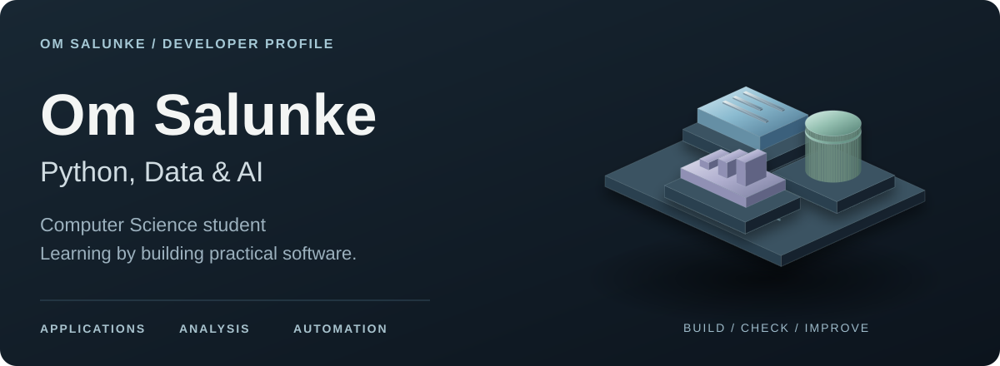
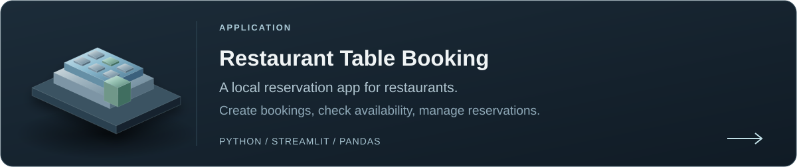
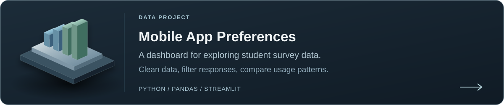
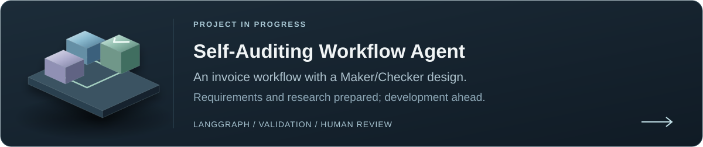
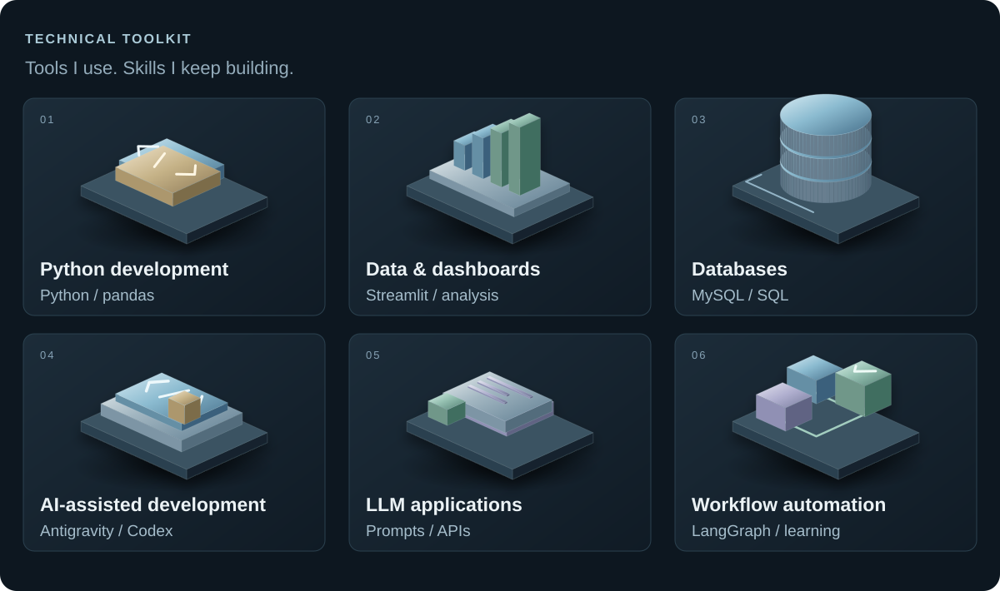
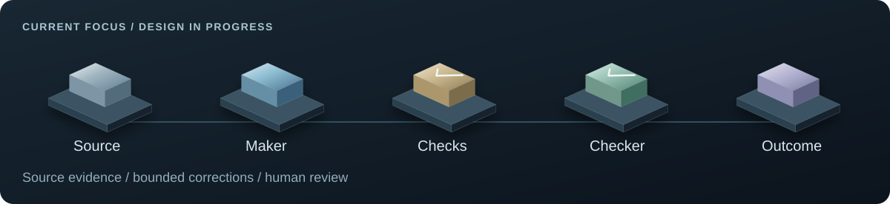
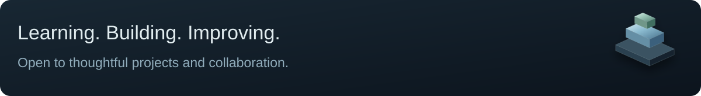

<picture>
  <source media="(max-width: 600px) and (prefers-reduced-motion: reduce)" srcset="assets/profile-hero-v2-mobile.svg">
  <source media="(max-width: 600px) and (prefers-reduced-motion: no-preference)" srcset="assets/profile-hero-v2-mobile-animated.svg">
  <source media="(prefers-reduced-motion: no-preference)" srcset="assets/profile-hero-v2-animated.svg">
  <source media="(max-width: 600px)" srcset="assets/profile-hero-v2-mobile.svg">
  
</picture>

  <a href="#selected-work">Projects</a> &nbsp; / &nbsp;
  <a href="#technical-toolkit">Skills</a> &nbsp; / &nbsp;
  <a href="#current-focus">Current focus</a> &nbsp; / &nbsp;
  <a href="#how-i-work">My approach</a>

I'm Om, a second-year B.Sc. Computer Science student. I build small Python applications and data dashboards, and I'm learning to design AI workflows that check their output and bring a person in when needed.

## Selected work

<a href="https://github.com/om-salunke-ai/restaurant-table-booking">
<picture>
  <source media="(max-width: 600px) and (prefers-reduced-motion: reduce)" srcset="assets/project-booking-mobile.svg">
  <source media="(max-width: 600px) and (prefers-reduced-motion: no-preference)" srcset="assets/project-booking-mobile-animated.svg">
  <source media="(prefers-reduced-motion: no-preference)" srcset="assets/project-booking-animated.svg">
  <source media="(max-width: 600px)" srcset="assets/project-booking-mobile.svg">
  
</picture>
</a>

<a href="https://github.com/om-salunke-ai/mobile-app-analysis">
<picture>
  <source media="(max-width: 600px) and (prefers-reduced-motion: reduce)" srcset="assets/project-analysis-mobile.svg">
  <source media="(max-width: 600px) and (prefers-reduced-motion: no-preference)" srcset="assets/project-analysis-mobile-animated.svg">
  <source media="(prefers-reduced-motion: no-preference)" srcset="assets/project-analysis-animated.svg">
  <source media="(max-width: 600px)" srcset="assets/project-analysis-mobile.svg">
  
</picture>
</a>

<a href="https://github.com/om-salunke-ai/Self-Auditing-Agent">
<picture>
  <source media="(max-width: 600px) and (prefers-reduced-motion: reduce)" srcset="assets/project-agent-mobile.svg">
  <source media="(max-width: 600px) and (prefers-reduced-motion: no-preference)" srcset="assets/project-agent-mobile-animated.svg">
  <source media="(prefers-reduced-motion: no-preference)" srcset="assets/project-agent-animated.svg">
  <source media="(max-width: 600px)" srcset="assets/project-agent-mobile.svg">
  
</picture>
</a>

## Technical toolkit

<picture>
  <source media="(max-width: 600px) and (prefers-reduced-motion: reduce)" srcset="assets/skill-toolkit-v2-mobile.svg">
  <source media="(max-width: 600px) and (prefers-reduced-motion: no-preference)" srcset="assets/skill-toolkit-v2-mobile-animated.svg">
  <source media="(prefers-reduced-motion: no-preference)" srcset="assets/skill-toolkit-v2-animated.svg">
  <source media="(max-width: 600px)" srcset="assets/skill-toolkit-v2-mobile.svg">
  
</picture>

- **Python, pandas & Streamlit:** cleaning data, building dashboards, and turning an idea into a small app.
- **SQL & MySQL:** writing queries and working with relational data.
- **AI-assisted development:** using Google Antigravity and Codex to explore code, plan changes, and review results. My Antigravity experience includes its CLI, IDE, and 2.0 workflows.
- **Prompts, APIs & automation:** writing clear instructions, working with structured outputs, and connecting the steps of a workflow.

## Current focus

I'm developing a **Self-Auditing Workflow Automation Agent** for invoice extraction. Its requirements and research are prepared; the next architecture and implementation stages are still ahead.

<picture>
  <source media="(max-width: 600px) and (prefers-reduced-motion: reduce)" srcset="assets/workflow-focus-mobile.svg">
  <source media="(max-width: 600px) and (prefers-reduced-motion: no-preference)" srcset="assets/workflow-focus-mobile-animated.svg">
  <source media="(prefers-reduced-motion: no-preference)" srcset="assets/workflow-focus-animated.svg">
  <source media="(max-width: 600px)" srcset="assets/workflow-focus-mobile.svg">
  
</picture>

What I'm learning through this project:

- **LangGraph:** state, conditional routes, and bounded correction loops.
- **Maker/Checker design:** separating a proposed answer from the checks used to accept it.
- **Validation & source evidence:** checking structured data and tracing values back to the original document.
- **Human review & audit history:** planning how uncertain results reach a person and how decisions are recorded.
- **FastAPI & application security:** local API design, input boundaries, credential handling, and privacy.

## How I work

I start with a clear requirement, break it into smaller steps, and review the changes along the way. AI tools help me move faster, but I still need to understand the code and explain why a decision was made.

I'm continuing to practise Python, SQL, and data structures and algorithms alongside these projects. I'm open to learning with other developers and contributing to work I can understand and improve.

<picture>
  <source media="(max-width: 600px) and (prefers-reduced-motion: reduce)" srcset="assets/profile-footer-mobile.svg">
  <source media="(max-width: 600px) and (prefers-reduced-motion: no-preference)" srcset="assets/profile-footer-mobile-animated.svg">
  <source media="(prefers-reduced-motion: no-preference)" srcset="assets/profile-footer-animated.svg">
  <source media="(max-width: 600px)" srcset="assets/profile-footer-mobile.svg">
  
</picture>
