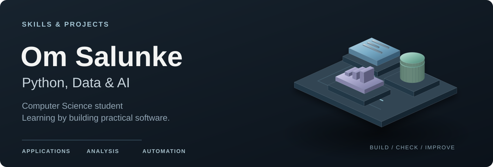
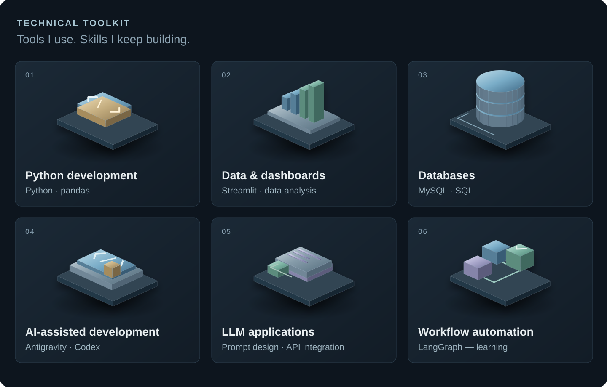

  

# Skills & Projects

I'm Om, a second-year B.Sc. Computer Science student. I work with Python to build small applications and explore data. I'm also learning how to build AI workflows where the output gets checked and a person can step in when needed.

## My toolkit

  

- **Python, pandas & Streamlit:** cleaning data, building dashboards, and turning an idea into a small app.
- **SQL & MySQL:** writing queries and working with relational data.
- **AI-assisted development:** using Google Antigravity and Codex to explore code, plan changes, and review the result. My Antigravity experience includes its CLI, IDE, and 2.0 workflows.
- **Prompts, APIs & automation:** writing clear instructions, working with structured outputs, and connecting the steps of a workflow.

## What I'm learning now

My current focus is a **Self-Auditing Workflow Automation Agent** for invoice extraction. I'm working through its requirements before the next architecture and implementation stages.

- **LangGraph:** understanding state, conditional routes, and correction loops.
- **Maker/Checker workflows:** separating an AI's proposed answer from the checks used to accept it.
- **Validation & evidence:** checking structured data and tracing extracted values back to their source.
- **Human review & audit history:** planning how uncertain results reach a person and how decisions are recorded.
- **FastAPI & application security:** learning local API design, input boundaries, credential handling, and privacy.

## Projects

| Project | What I worked on |
| --- | --- |
| [Restaurant Table Booking System](https://github.com/om-salunke-ai/restaurant-table-booking) | A Streamlit app for creating and managing local restaurant reservations. |
| [Mobile App Preferences Analysis](https://github.com/om-salunke-ai/mobile-app-analysis) | A Streamlit dashboard for cleaning and exploring student survey data. |
| [Self-Auditing Workflow Automation Agent](https://github.com/om-salunke-ai/Self-Auditing-Agent) | An invoice workflow project I'm developing with LangGraph. Requirements and research are prepared, with further development ahead. |

## How I work

I start with a clear requirement, break it into smaller steps, and review the changes along the way. AI tools help me move faster, but I still need to understand the code and explain why a decision was made.

I'm continuing to practise Python, SQL, and data structures and algorithms alongside these projects. I'm open to learning with other developers and contributing to projects I can understand and improve.
